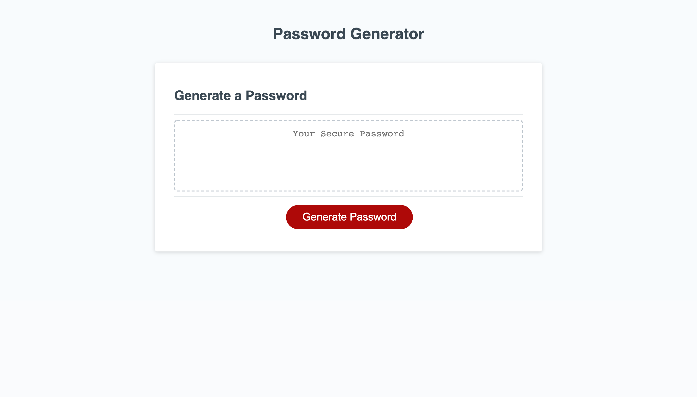

# password-generator

Password generator that generates randomized password based around user inputs.

## Functionality

* Asks user what length password is desired.

* Asks user what type of characters are desired--uppercase, lowercase, numeric, or special.

* Randomizes characters of generated password.

* Once password is generated, password displays on the webpage.

## Link to Application

https://laurenlgoss.github.io/password-generator/

## Screenshot of Application

